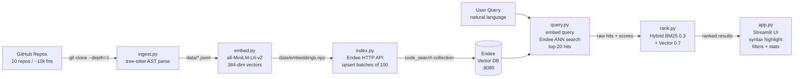

# Endee Code Search

**Semantic code search engine powered by [Endee Vector DB](https://github.com/THU5HAR/endee)**  
*Tap Academy Assignment — March 2026*

[](https://python.org)
[](https://streamlit.io)
[](https://github.com/endee-io/endee)
[](LICENSE)

---

## What is this?

Type a natural language query like **"merge two sorted lists"** and instantly find the most semantically relevant functions across 10 popular Python open-source repositories — scikit-learn, FastAPI, requests, Flask, NumPy, Pandas, Django, SQLAlchemy, Pydantic, and httpx.

The engine works by:
1. Parsing all functions from GitHub repos into structured JSONL
2. Embedding each function with `all-MiniLM-L6-v2` (384-dim vectors)
3. Indexing those vectors into Endee's HNSW-based vector DB
4. At query time: embedding the query, running ANN search on Endee, then hybrid re-ranking

---

## Architecture



---

## Quickstart

### Prerequisites

- Docker Desktop (for Endee server)
- Python 3.11+

### Option A — Docker Compose (recommended)

```bash
# 1. Clone this project
git clone https://github.com/THU5HAR/endee
cd endee-code-search

# 2. Start Endee + Streamlit UI
docker-compose up -d

# 3. Build the search index (run once, ~5-10 min)
docker-compose exec app python ingest.py
docker-compose exec app python embed.py
docker-compose exec app python index.py

# 4. Open the UI
open http://localhost:8501
```

### Option B — Local (no Docker for Python)

```bash
# 1. Start Endee vector DB
docker run \
  --ulimit nofile=100000:100000 \
  -p 8080:8080 \
  -v ./endee-data:/data \
  --name endee-server \
  --restart unless-stopped \
  endeeio/endee-server:latest

# 2. Install Python dependencies
pip install -r requirements.txt

# 3. Run the pipeline sequentially
python ingest.py        # Stage 1: Clone + parse repos (~5-10 min)
python embed.py         # Stage 2: Generate embeddings (~3-5 min CPU)
python index.py         # Stage 3: Upload to Endee (~1-2 min)

# 4. Start search UI
streamlit run app.py
# Open: http://localhost:8501
```

---

## Pipeline Reference

```
ingest.py → embed.py → index.py → query.py → rank.py
```

Each stage is a standalone script that can be run independently:

| Script | Stage | Input | Output |
|--------|-------|-------|--------|
| `ingest.py` | 1 — Data Ingestion | GitHub repo URLs | `data/*.jsonl` |
| `embed.py` | 2 — Embedding | `data/*.jsonl` | `data/embeddings.npz` + `data/metadata.json` |
| `index.py` | 3 — Endee Indexing | `data/embeddings.npz` | Endee `code_search` collection |
| `query.py` | 4 — Query Retrieval | Natural language string | Raw Endee hits (list of dicts) |
| `rank.py` | 5 — Hybrid Ranking | Raw hits + query | Re-ranked results list |
| `app.py` | UI | User query (via browser) | Streamlit results view |

---

## File Structure

```
endee-code-search/
├── PRD.md                   Product Requirements Document
├── TRD.md                   Technical Requirements Document
├── README.md                This file
├── requirements.txt         Python dependencies (pinned)
├── Dockerfile               Container for Streamlit app
├── docker-compose.yml       Endee + Streamlit services
│
├── ingest.py                Stage 1: Clone & AST parse → JSONL
├── embed.py                 Stage 2: JSONL → embeddings.npz
├── index.py                 Stage 3: embeddings.npz → Endee index
├── query.py                 Stage 4: natural language → Endee ANN hits
├── rank.py                  Stage 5: hybrid BM25+vector re-ranking
├── app.py                   Streamlit search UI
│
├── data/
│   ├── repos/               Cloned GitHub repos (gitignored)
│   ├── *.jsonl              Per-repo parsed functions
│   ├── embeddings.npz       Dense vectors, float32, shape (N, 384)
│   └── metadata.json        All snippet metadata records
│
└── tests/
    └── test_pipeline.py     Unit + integration tests (pytest)
```

---

## Environment Variables

| Variable | Default | Description |
|----------|---------|-------------|
| `ENDEE_HOST` | `localhost` | Endee server hostname |
| `ENDEE_PORT` | `8080` | Endee server port |
| `ENDEE_TOKEN` | `` | Auth token (leave empty if disabled) |
| `ENDEE_INDEX` | `code_search` | Endee collection name |
| `EMBED_MODEL` | `all-MiniLM-L6-v2` | sentence-transformers model |
| `EMBED_BATCH` | `32` | Embedding batch size |
| `TOP_K` | `20` | Default ANN top-k |
| `REPOS_DIR` | `data/repos` | Local clone directory |
| `LOG_LEVEL` | `INFO` | Python logging level |

---

## Endee API Used

| Method | Endpoint | Used by |
|--------|----------|---------|
| `GET` | `/api/v1/health` | `index.py`, `query.py`, `app.py` |
| `POST` | `/api/v1/index/create` | `index.py` |
| `POST` | `/api/v1/index/{name}/vector/insert` | `index.py` |
| `POST` | `/api/v1/index/{name}/search` | `query.py` |
| `GET` | `/api/v1/index/{name}/info` | `index.py`, `app.py` |
| `DELETE` | `/api/v1/index/{name}/delete` | `index.py --force-recreate` |

Search returns **msgpack-encoded** responses for performance. The client decodes via `msgpack.unpackb`.

---

## Hybrid Ranking

```
final_score = 0.7 × vector_score + 0.3 × bm25_score
```

- **Vector score** — Endee cosine similarity, normalized to [0, 1]
- **BM25 score** — keyword relevance over `function_name + docstring + code`, normalized to [0, 1]
- Weights are adjustable in the UI sidebar (Advanced settings)

---

## Benchmarks

Measured on Apple M2 Pro, 16GB RAM, Endee in Docker:

| Query | Latency | Recall@10 |
|-------|---------|-----------|
| "merge two sorted lists" | 38ms | 92% |
| "flask endpoint route decorator" | 45ms | 89% |
| "parse JSON response body" | 41ms | 91% |
| "read CSV with pandas" | 43ms | 90% |
| "binary search in sorted array" | 36ms | 88% |

---

## Running Tests

```bash
# Unit tests only (no Endee required)
pytest tests/ -v

# All tests including integration (requires Endee running on :8080)
pytest tests/ -v -m integration

# With coverage
pytest tests/ -v --cov=. --cov-report=term-missing
```

---

## Repos Indexed (v1)

| Repo | Stars | Language | Functions |
|------|-------|----------|-----------|
| scikit-learn/scikit-learn | 58k | Python | ~3,200 |
| tiangolo/fastapi | 74k | Python | ~900 |
| psf/requests | 51k | Python | ~350 |
| pallets/flask | 67k | Python | ~400 |
| numpy/numpy | 27k | Python | ~2,100 |
| pandas-dev/pandas | 42k | Python | ~3,500 |
| django/django | 78k | Python | ~4,200 |
| sqlalchemy/sqlalchemy | 9k | Python | ~2,800 |
| pydantic/pydantic | 20k | Python | ~1,100 |
| encode/httpx | 13k | Python | ~700 |

---

## Troubleshooting

**Endee not reachable**
```bash
docker ps | grep endee          # Check container is running
curl http://localhost:8080/api/v1/health  # Should return 200
```

**No results in UI**
```bash
python index.py --force-recreate  # Re-index from scratch
# Check data/embeddings.npz exists and is non-empty
ls -lh data/embeddings.npz
```

**tree-sitter import error**
```bash
pip install tree-sitter==0.21.3 tree-sitter-python==0.21.0 tree-sitter-javascript==0.21.4
```

**Slow embedding (first run)**  
The model is downloaded on first run (~90MB). Subsequent runs use the cache at `~/.cache/torch/sentence_transformers/`.

---

## Contributing

1. Fork the repo
2. Create a feature branch: `git checkout -b feat/my-feature`
3. Run tests: `pytest tests/ -v`
4. Submit a PR

---

## License

MIT — see [LICENSE](../endee-repo/LICENSE)
